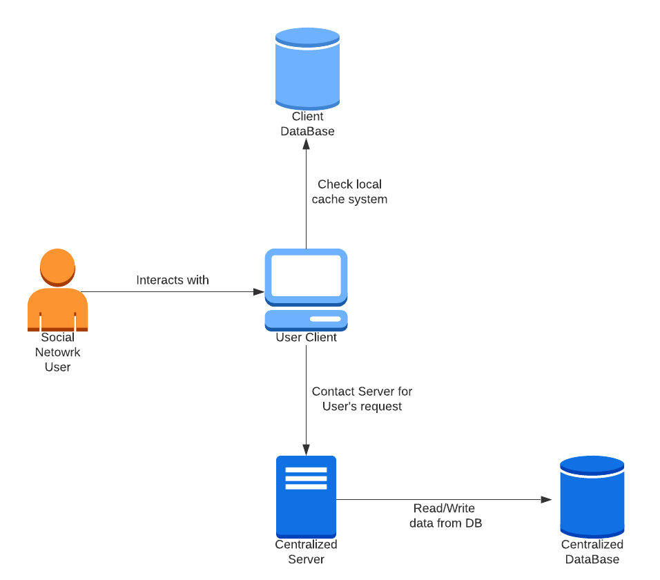
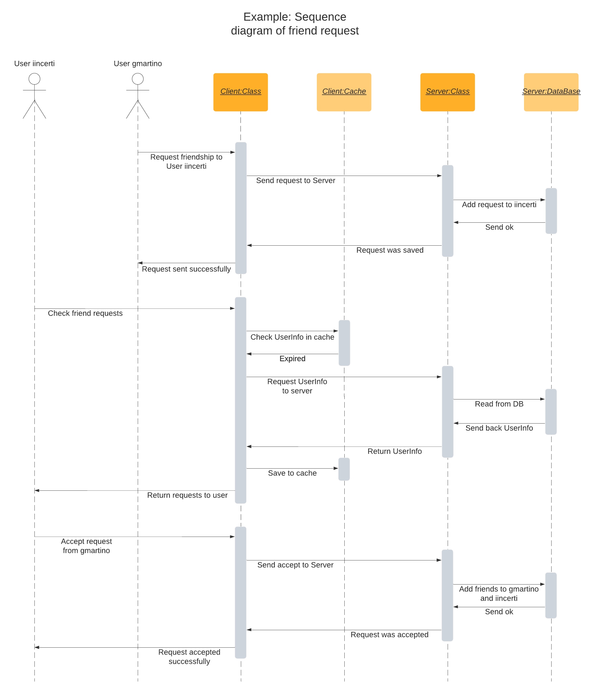

# ASSN - Distributed Social Network

## Introduction

The following document is intended to specify the purpose, description and features of the project along with the
technical requirements.

This is a University project demonstrating how to implement a distributed application, specifically a Social Network,
using Java RMI.

The purpose is to provide each user with a Command Line Interface to interact with the Client, which will send the
requests to the registered Server.

## Architecture

The selected architecture is Client-Server. One centralized Server manages all the Users and the 
DataBase operations, while each Client represent one User logged into the system.

Each Client also has a local Database for caching responses from the Server. The standard expiration 
time is set to 10 seconds.



## Data Description

Information about each User, including login credentials, connected friends and received requests needs to be stored.
Also, each Post must have his unique data and all the comments saved.

The DataBase has been implemented in-memory. It consists of four different entities:

| UserInfo |
|----------|
| name     |
| surname  |

Entity associated to `User`

<br>

| User                                                  |
|-------------------------------------------------------|
| username                                              |
| password                                              |
| `UserInfo` (name, surname)                            |
| Friends (List of user's friends)                      |
| Requests (List of user's pending friend requests) |

Contains all the info about the users:

<br>

| Post                                                    |
|---------------------------------------------------------|
| uuid (to uniquely identify each Post)                   |
| writer (username of Post creator)                       |
| content                                                 |
| createdAt (timestamp useful to order posts temporarily) |
| `Comments` (List of comments for the post)              |

Entity with all the Posts of the platform. These will be filtered according to users.

<br>

| Comment   |
|-----------|
| writer    |
| content   |
| createdAt |

Each comment associated with one `Post`

<br>

## Features

### Client Features

A logged User should be able to:

1. Get his info, including a list of friends and pending request
2. Send a friend request to some User
3. Accept one of the pending requests from one User
4. Write a new Post
5. See all the Posts (his own or the ones from his friends)
6. Comment a specific Post (through the uuid)
7. Exit from the CLI

### System Features

The expected behaviour of the system, in relationship with the Client features above,
is the following:

1. Before calling the server, check if the User info saved on the local cache is expired
2. Always check if the specified User exists
3. Check if the specified User exists and if it was on the Requests list
4. Before calling the server, check if the Posts saved in the local cache are expired
5. Collect all the Posts available for the specified User
6. Check if the Post exists and if the User is allowed to comment it

Apart from that, the server is in charge of initialising the Users from a data source (in this
case implemented through a .CSV file), checking the correctness of the login credentials and
managing the read and write operations to the DataBase.

## Sequence diagram

One example of a sequence diagram has been represented, involving two different Users, and it shows 
three consecutive actions:

The first User send a friend request to the second User.

The second User has to check its info in order to see the new request.

Once it finds a new request it can accept it.



## Technical Requirements

The following specified requirements are the ones used to develop and test the app, they should not be intended as
strict requirements, but having these it is guaranteed for the system to work.

- OpenJDK 11+
- javac 11+
- Ubuntu 20.04
- `rmiregistry` up and running
- `bash` or any other terminal to interact with the system


## Usage

Run name server (in background)

```shell
$ rmiregistry &
```

If needed, compile all Java source files

```shell
$ javac *.java
```

Start the server by calling it

```shell
$ java Server
```

Start one client by calling it and passing username and password

```shell
$ java ASSNClient <username> <password>
```